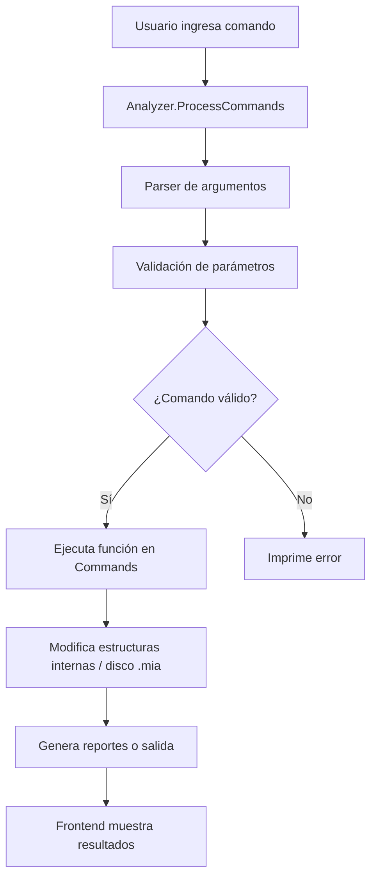

## Jose Sebastian Pirir Romero - 202300335
---

# Manual Técnico – Sistema de Archivos EXT2 Simulado

## 1. Descripción General

El sistema de archivos **EXT2 simulado** permite la gestión de **discos virtuales `.mia`** mediante comandos interactivos.
Está diseñado con una arquitectura modular que separa la **interfaz de usuario** de la **lógica interna de manejo de archivos y estructuras de disco**.

---

## 2. Arquitectura del Sistema

### 2.1 Componentes Principales

| Componente                   | Descripción                                                                                |
| ---------------------------- | ------------------------------------------------------------------------------------------ |
| **Frontend**                 | Interfaz (CLI o web) donde el usuario ingresa comandos y visualiza resultados.             |
| **Analyzer (`analyzer.go`)** | Procesa los comandos, parsea argumentos y ejecuta funciones correspondientes.              |
| **Commands (`commands/`)**   | Implementa cada comando del sistema de archivos.                                           |
| **FS (`fs/`)**               | Funciones de lectura/escritura en bloques, directorios y archivos dentro del disco `.mia`. |
| **State (`state/`)**         | Manejo de particiones montadas y sesiones activas.                                         |
| **Structs (`structs/`)**     | Define las estructuras internas como `SuperBlock`, `Inode`, `Bloques` y `MBR`.             |

### 2.2 Flujo de Ejecución de Comandos

---

## 3. Estructuras de Datos del Sistema

### 3.1 MBR (Master Boot Record)

El **MBR** almacena información principal de las particiones de un disco virtual.

* **mbr\_size**: Tamaño total del disco.
* **mbr\_date**: Fecha y hora de creación.
* **mbr\_signature**: Identificador único del disco.
* **mbr\_partitions**: Arreglo de hasta 4 particiones (primarias o extendidas).

---

### 3.2 Partición

* **part\_status**: Estado de la partición (`0` = inactiva, `1` = activa).
* **part\_type**: Tipo de partición (`P` = primaria, `E` = extendida, `L` = lógica).
* **part\_fit**: Estrategia de ajuste (`B` = Best, `F` = First, `W` = Worst).
* **part\_start**: Byte de inicio de la partición.
* **part\_size**: Tamaño en bytes.
* **part\_name**: Nombre de la partición.

---

### 3.3 SuperBlock

Cada partición formateada contiene un **SuperBlock** con la información del sistema de archivos.

* **s\_inodes\_count**: Número total de inodos.
* **s\_blocks\_count**: Número total de bloques.
* **s\_free\_blocks\_count**: Bloques libres.
* **s\_free\_inodes\_count**: Inodos libres.
* **s\_mtime**: Última fecha de montaje.
* **s\_umtime**: Última fecha de desmontaje.
* **s\_magic**: Número mágico (`0xEF53` para EXT2).
* **s\_inode\_size**: Tamaño de cada inodo.
* **s\_block\_size**: Tamaño de cada bloque.
* **s\_first\_ino**: Primer inodo libre.
* **s\_first\_blo**: Primer bloque libre.

---

### 3.4 Inodo

Representa archivos o directorios.

* **i\_uid**: ID del usuario propietario.
* **i\_gid**: ID del grupo.
* **i\_size**: Tamaño del archivo.
* **i\_atime**: Último acceso.
* **i\_ctime**: Fecha de creación.
* **i\_mtime**: Última modificación.
* **i\_block\[15]**: Punteros a bloques de datos (directos e indirectos).
* **i\_type**: Tipo (`0` = archivo, `1` = directorio).
* **i\_perm**: Permisos.

---

### 3.5 Bloques

* **Bloque de carpetas**: Contiene entradas a archivos y subdirectorios.
* **Bloque de archivos**: Contiene datos en bruto del archivo.
* **Bloque de apuntadores**: Contiene referencias a otros bloques (indirectos).

---

## 4. Comandos Principales

### 4.1 Manejo de Discos

* `mkdisk` → Crear un nuevo disco virtual `.mia`.
* `rmdisk` → Eliminar un disco.

### 4.2 Manejo de Particiones

* `fdisk` → Crear, eliminar o redimensionar particiones.
* `mount` → Montar una partición.
* `unmount` → Desmontar una partición.

### 4.3 Manejo del Sistema de Archivos

* `mkfs` → Formatear una partición como EXT2.
* `login` / `logout` → Iniciar/cerrar sesión.
* `mkfile` → Crear archivos.
* `mkdir` → Crear directorios.
* `cat` → Mostrar contenido de un archivo.
* `remove` → Eliminar archivos o directorios.

### 4.4 Reportes

* `rep` → Generar reportes en formato `.dot` y `.png`:

  * `mbr` → Reporte del MBR.
  * `disk` → Estructura del disco.
  * `inode` → Tabla de inodos.
  * `block` → Bloques.
  * `tree` → Árbol del sistema de archivos.

---

## 5. Flujo de Uso del Sistema

1. Crear un disco con `mkdisk`.
2. Crear particiones con `fdisk`.
3. Montar partición con `mount`.
4. Formatear con `mkfs`.
5. Crear usuarios y loguearse.
6. Crear directorios y archivos (`mkdir`, `mkfile`).
7. Generar reportes (`rep`).

---

## 6. Consideraciones Técnicas

* El sistema simula operaciones a nivel de bytes en un archivo `.mia`.
* La persistencia de datos se maneja mediante escritura binaria en Go.
* Los reportes se generan con **Graphviz** (`dot`).
* La arquitectura modular permite extender fácilmente los comandos.

---